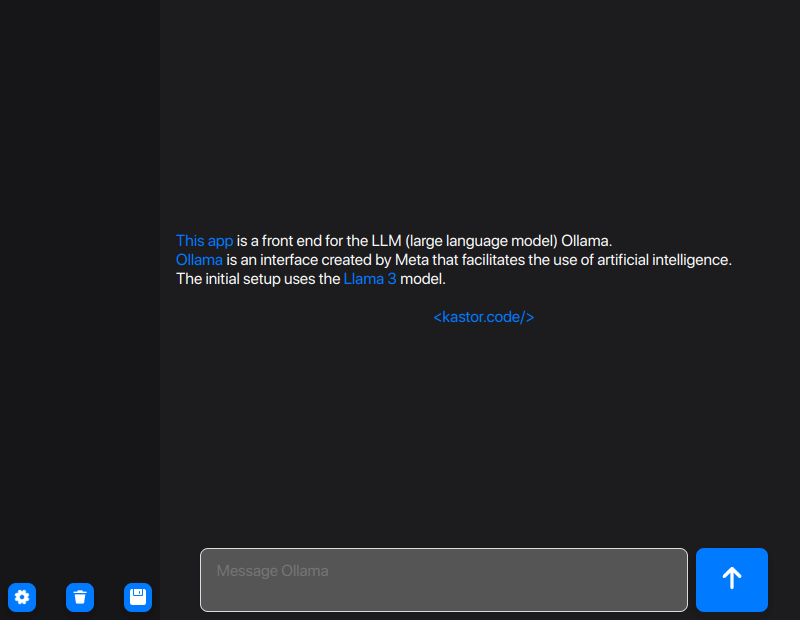
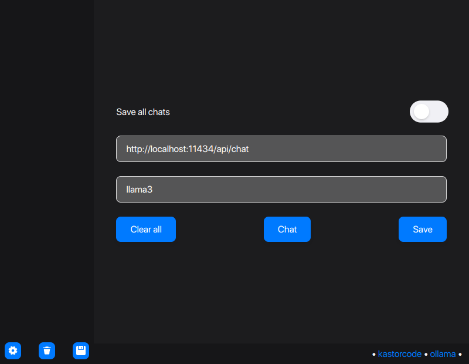
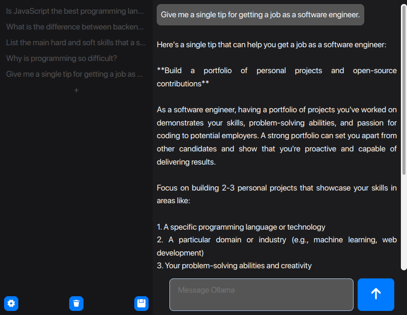
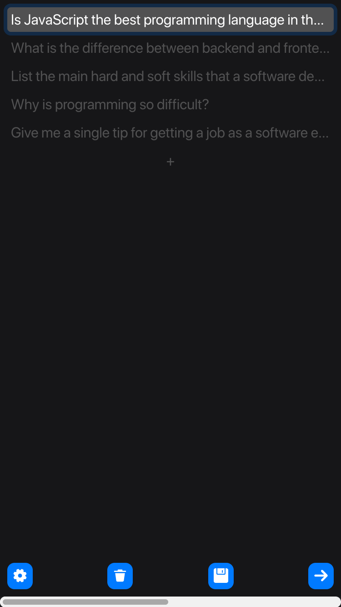
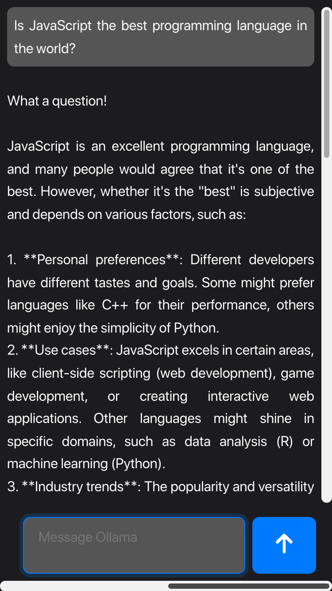

## Ollama LLM Graphical User Interface

> 👨‍💻 Developed by Matheus Ramalho de Oliveira  
🏗️ Brazilian Software Engineer  
✉️ kastorcode@gmail.com  
🦫 [LinkedIn](https://br.linkedin.com/in/kastorcode) • [Instagram](https://instagram.com/kastorcode)

---

  

  This application is a frontend for the LLM (large language model) Ollama. Ollama is an interface created by Meta that facilitates the use of artificial intelligence.

---

### Screenshots

  
  
  
  
  
  

---

### Technologies
[Craco](https://craco.js.org)  
[Flux Architecture](https://facebookarchive.github.io/flux)  
[React.js](https://react.dev)  
[React Hooks Global State](https://npmjs.com/package/react-hooks-global-state)  
[React Router](https://reactrouter.com)  
[React Transition Group](https://reactcommunity.org/react-transition-group)  
[Styled Components](https://styled-components.com)  
[TypeScript](https://typescriptlang.org)

---

### Installation and execution

1. You need to have the [Ollama server](https://ollama.com/download) installed on your machine, or configure the app to use an external URL;
2. Make a clone of this repository;
3. Open the project folder in a terminal;
4. Run `yarn` to install dependencies;
5. Run `yarn start` to launch at `http://localhost:3000`.

---

  <big><b>&lt;kastor.code/&gt;</b></big>

